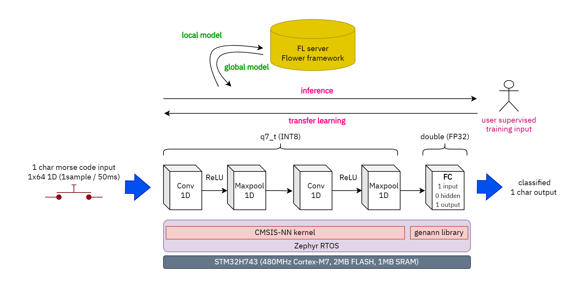

# morse-tinyfedml-firmware
**Morse code regonition TinyML model with Federated Learning**

## Link
Here is firmware repository, see below for other part of repository.
- firmware : *here*
- reference model : [Dictor/morse-tinyfedml-reference-model](https://github.com/Dictor/morse-tinyfedml-reference-model) 
- FL server : TBD

## Reference
- [1] ["On-Device Training of Machine Learning Models on Microcontrollers with Federated Learning", Llisterri et al., 2022](https://www.mdpi.com/2079-9292/11/4/573)
- [2] ["Morse Code Datasets for Machine Learning", Dey et al., 2018](https://ieeexplore.ieee.org/document/8494011)
- [3] ["CMSIS-NN: Efficient Neural Network Kernels for Arm Cortex-M CPUs", Lai et al., 2018](https://arxiv.org/abs/1801.06601)
- [4] ["Tensorflow Lite 8bit quantization specification"](https://www.tensorflow.org/lite/performance/quantization_spec?hl=ko)
